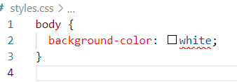

# stylelint-config-htmlacademy

[![Test Status][test-image]][test-url]
[![License: MIT][license-image]][license-url]
[![NPM version][npm-image]][npm-url]
[![Vulnerabilities count][vulnerabilities-image]][vulnerabilities-url]

> Это стандартный конфигурационный файл для stylelint от [HTML Academy](https://htmlacademy.ru/).

Используйте его как есть или как основу для вашей собственной конфигурации.

## Установка

Вместе с конфигом установите и сам `stylelint`.

```sh
npm i -D stylelint-config-htmlacademy stylelint
```

## Использование

В корне проекта создайте файл `.stylelintrc` и в нём добавьте `stylelint-config-htmlacademy` в поле `extends`.

_.stylelintrc_

```json
{
  "extends": "stylelint-config-htmlacademy"
}
```

Если вы установили `stylelint-config-htmlacademy` глобально с помощью флага `-g`, тогда вам нужно использовать абсолютный путь `stylelint-config-htmlacademy` в конфигурационном файле:

_.stylelintrc_

```json
{
  "extends": "/absolute/path/to/stylelint-config-htmlacademy"
}
```

## Расширение конфига

Вы можете переопределить существующие правила или добавить новые.

Для этого добавьте в конфиг поле `rules` с нужными вам переопределениями правил.

_.stylelintrc_

```json
{
  "extends": "stylelint-config-htmlacademy",
  "rules": {
    "property-no-unknown": [
      true,
      {
        "ignoreProperties": [
          "composes"
        ]
      }
    ],
    "unit-whitelist": ["em", "rem", "s", "px"]
  }
}
```

В этом же поле `rules` можно переопределять и больше не поддерживаемые самим Stylelint [стилистические правила](https://github.com/firefoxic/stylelint-codeguide/blob/main/docs/user-guide/rules.md#rules) из плагина `stylelint-codeguide`, добавив перед названием правила префикс `codeguide/`.

_.stylelintrc_

```json
{
  "extends": "stylelint-config-htmlacademy",
  "rules": {
    "property-no-unknown": [
      true,
      {
        "ignoreProperties": [
          "composes"
        ]
      }
    ],
    "unit-whitelist": ["em", "rem", "s", "px"],

    "codeguide/indentation": "tab",
    "codeguide/number-leading-zero": null
  }
}
```

## Использование в VSCode

1. Установите стайллинт и конфиг
2. Откройте VScode
3. Установите плагин [stylelint](https://marketplace.visualstudio.com/items?itemName=stylelint.vscode-stylelint)
4. Пользуйтесь



[test-url]: https://github.com/htmlacademy/stylelint-config-htmlacademy/actions
[test-image]: https://github.com/htmlacademy/stylelint-config-htmlacademy/actions/workflows/test.yml/badge.svg?branch=main

[npm-url]: https://npmjs.org/package/stylelint-config-htmlacademy
[npm-image]: https://badge.fury.io/js/stylelint-config-htmlacademy.svg

[license-url]: https://github.com/htmlacademy/stylelint-config-htmlacademy/blob/main/LICENSE
[license-image]: https://img.shields.io/badge/License-MIT-limegreen.svg

[vulnerabilities-url]: https://snyk.io/test/github/htmlacademy/stylelint-config-htmlacademy
[vulnerabilities-image]: https://img.shields.io/snyk/vulnerabilities/npm/stylelint-config-htmlacademy
