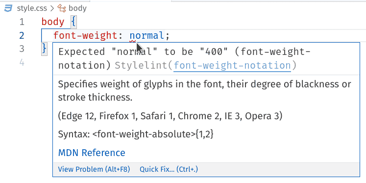

# stylelint-config-htmlacademy
> Это стандартный конфигурационный файл для stylelint от [HTML Academy](https://htmlacademy.ru/).

Используйте его как есть или как основу для вашей собственной конфигурации.

## Установка

```bash
npm install stylelint-config-htmlacademy --save-dev
```

## Использование

Если в вашем проекте ещё нет stylelint, то в корне проекта создайте файл `.stylelintrc`, либо с расширением `.stylelintrc.js`, чтобы редактор кода мог выделить синтаксис.

После добавьте `stylelint-config-htmlacademy` в конфигурационный файл `.stylelintrc`.

_.stylelintrc_
```json
{
  "extends": "stylelint-config-htmlacademy"
}
```

Если вы установили `stylelint-config-htmlacademy` глобально с помощью флага `-g`, тогда вам нужно использовать абсолютный путь `stylelint-config-htmlacademy` в конфигурационном файле:


_.stylelintrc_
```json
{
  "extends": "/absolute/path/to/stylelint-config-htmlacademy"
}
```

## Расширение конфига

Вы можете переопределить существующие правила или добавить новые.

Для этого добавьте ключ `"rules"` в конфиг сразу после `"extends": "stylelint-config-htmlacademy"`, а затем добавляйте свои правила.

_.stylelintrc_
```json
{
  "extends": "stylelint-config-htmlacademy",
  "rules": {
    "indentation": "tab",
    "number-leading-zero": null,
    "property-no-unknown": [ true, {
      "ignoreProperties": [
        "composes"
      ]
    }],
    "unit-whitelist": ["em", "rem", "s", "px"]
  }
}
```

## Использование в VSCode

1. Откройте VScode
2. Установите плагин [stylelint](https://marketplace.visualstudio.com/items?itemName=stylelint.vscode-stylelint)
3. Пользуйтесь
4. В случае если ваш код не соответствует правилам `stylelint-config-htmlacademy` он будет подчёркнут красной линией.



_в примере сработало правило `'color-named' : 'never'`, которое запрещает использовать цвета по имени_
